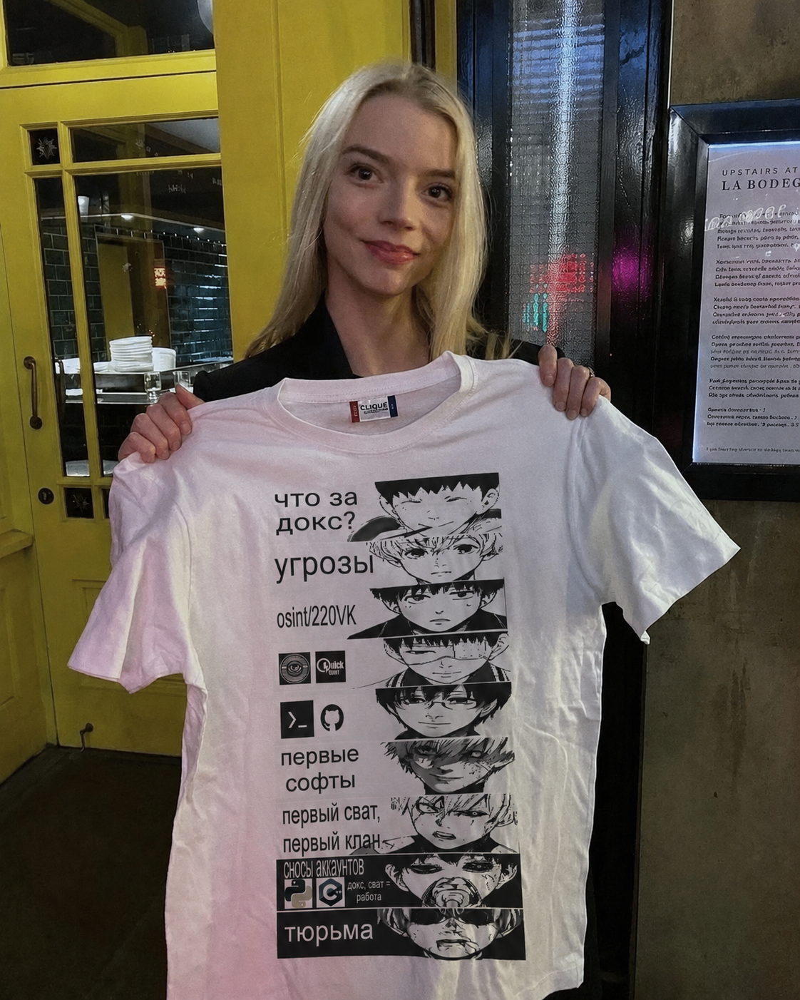

# OSINT Patterns

`OSINT Patterns` is a structured knowledge base with practical materials on open-source intelligence.  
The repository combines methodology and topic-specific guides so OSINT can be applied as an analytical process, not just a set of tools.

Main directions in this project:

- Email OSINT
- GEOINT
- HUMINT
- Sock Puppet / Legend Building

## Repository Structure

```text
.
├── README.md
├── docs/
│   ├── email-osint/
│   │   └── email-osint-pattern-full.pdf
│   ├── geoint/
│   │   └── geoint-tools.md
│   ├── humint/
│   │   └── humint-art-of-deception.md
│   └── sock-puppet/
│       └── sock-puppet-legend-building.md
```

## Topics

- Email OSINT: [`docs/email-osint/email-osint-pattern-full.pdf`](docs/email-osint/email-osint-pattern-full.pdf)
- GEOINT Tools: [`docs/geoint/geoint-tools.md`](docs/geoint/geoint-tools.md)
- HUMINT: [`docs/humint/humint-art-of-deception.md`](docs/humint/humint-art-of-deception.md)
- Sock Puppet: [`docs/sock-puppet/sock-puppet-legend-building.md`](docs/sock-puppet/sock-puppet-legend-building.md)

---

# OSINT as an Analytical Process, Not a Toolkit

*In the popular imagination, OSINT has become a list of services: username lookup sites, bots, database aggregators, search operators. That framing is convenient for quick results — and that convenience is exactly what degrades the discipline. When OSINT is reduced to tools, it stops being analysis and becomes mechanical data collection: gathering without understanding why the data matters, or what it actually means.*


In practice, OSINT is neither technology nor software. It is a method of thinking — a structured approach to open-source material that sits far closer to classical intelligence analysis, investigative journalism, and the scientific method than it does to "finding information." Its foundation is not tools but logical sequence: forming hypotheses, testing them, correlating the results, and arriving at a measured conclusion that honestly accounts for uncertainty.


## It Starts With the Right Question

Every OSINT investigation begins not with a search, but with a question. And the quality of that question determines everything that follows.

*"Who is this?"* is a bad question. It is too broad to be tested and too vague to be answered.

*"Are these two digital profiles operated by the same person?"* is a good question. So is *"Is this company an independent entity or part of a larger structure?"* and *"Does the claimed geography match the actual one?"* These questions are specific, falsifiable, and point directly toward the evidence needed to resolve them.

The discipline of forming a precise question before touching a single tool is one of the clearest separators between analysts and data collectors.


## The Hypothesis: A Working Assumption, Not a Conclusion

From the question comes the hypothesis — a working assumption that must tolerate being wrong. It should not be comfortable. It should not confirm what the analyst already expects. Its only requirement is that it be testable.

Examples of workable hypotheses: *"The Telegram account and the GitHub profile belong to the same individual."* Or: *"This online project is affiliated with another group despite the absence of any formal connection."* Or: *"This photograph was taken earlier than its stated date."*

The hypothesis is a tool, not a destination. One of the most common errors among less experienced analysts is emotional attachment to the first version — an unconscious drift toward selecting data that confirms the initial assumption while discarding data that complicates it. This is confirmation bias, and it produces confident-sounding conclusions built on incomplete thinking.

The professional approach requires maintaining at least two competing hypotheses from the start — including the opposite one. Not just *"these are the same person"* but simultaneously *"these are different people with similar patterns."* The investigation continues until one version becomes clearly stronger than the others, not until the analyst finds enough to feel satisfied.


## Verification: Targeted, Not Exhaustive

Once the hypothesis is in place, verification begins. This is where open sources enter the process — but deliberately, not chaotically. The operative question is not *"what can I collect?"* but *"what data would confirm or disprove this specific assumption?"*

For account correlation, verification includes: temporal activity patterns, language and recurring phrasings, characteristic spelling errors, reactions to events, topical interests, and the structure of social connections.

For corporate analysis: registration records, amendment histories, domain infrastructure, contractors, legal document templates, and the digital traces left by employees.

No single source proves anything. Each source adds or subtracts weight from the hypothesis. That is all it does.

At this stage it is especially important to document contradictions, not just confirmations. Data that does not fit the working hypothesis must not be set aside. It either weakens the hypothesis or signals that it needs to be refined. Honesty with oneself is not a soft virtue in OSINT — it is a technical requirement.


## Correlation: Where Information Becomes Knowledge

After verification comes the most demanding and most undervalued part of the process: correlation. This is not simply aggregating information into a file or table. Correlation is the identification of relationships between data points that appear, on the surface, to be unconnected. It is where information becomes knowledge.

Correlation can be **temporal** — certain actions or events occurring in synchrony, or with a consistent lag. It can be **behavioural** — different subjects demonstrating identical responses under identical conditions. It can be **infrastructural** — recurring technical choices, identical domain registration patterns, shared hosting providers. It can be **social** — overlapping circles, common second- and third-degree points of contact.

Correlation is context, not proof. One matching IP range means nothing. But when the IP range, the domain registrar, the site structure, the update schedule, and the communication style all align — that is a system of indicators. The analyst is not working with individual facts. They are working with the weight of their accumulation.

A practical illustration: investigating the affiliation of two organisations. Formally they may share nothing — different legal entities, different nominal directors, different brands. But correlational analysis reveals identical contract templates, overlapping contractors, synchronised changes in documentation, the same typographic errors appearing in both bodies of text, the same approach to marketing and public communication. Each element is insignificant alone. Together they form a stable pattern.


## The Conclusion: Probability, Not Truth

After correlation, the analyst forms a conclusion. And here, categorical certainty is the enemy of accuracy.

A conclusion in OSINT is not a declaration of truth. It is an assessment of probability. A well-formed conclusion always states its confidence level, acknowledges the limitations of the data used, and accounts for alternative explanations that cannot be fully ruled out.

Formulations like *"with high probability," "likely," "cannot be excluded"* are often read as weakness. They are not. They are the markers of a professional working with sources that are, by definition, incomplete and susceptible to distortion. Claiming absolute certainty from open-source material does not make the conclusion stronger — it makes it dishonest.

The other essential criterion for a sound conclusion is **reproducibility**. If a second analyst, working from the same data and the same methodology, cannot arrive at a similar result, the conclusion is built on intuition rather than analysis. Intuition has its place — in hypothesis formation, where pattern recognition is genuinely useful. It has no place as the foundation of a final assessment.


## Cognitive Bias: The Structural Threat

OSINT analysts work constantly in conditions of information noise and data overload. Confirmation bias, anchoring to first impressions, selective attention — these are not character flaws. They are predictable features of human cognition under these conditions, and they directly shape how facts get interpreted.

This is why process discipline matters more than any individual tool. A rigorous structure — question, hypothesis, verification, correlation, conclusion — is not bureaucratic overhead. It is the mechanism that protects the analyst from their own thinking errors. Without it, even technically skilled analysis drifts toward whatever the analyst already believed.


## Context Is Not Optional

Finally: OSINT cannot be practiced without context. The same fact means different things in different environments. Anonymity is a norm on some platforms and an anomaly on others. A particular vocabulary may indicate a profession, a subculture, or a geographic region — but only if the analyst understands the cultural and social background in which it appears.

Without context, even precise data becomes noise. The tools can surface the information. Only the analyst can situate it.


## What OSINT Actually Is

OSINT is not the ability to find information. It is the ability to ask the right questions, form testable hypotheses, engage critically with data, identify connections across disparate sources, and articulate conclusions that accurately reflect what the evidence supports — and what it does not.

Tools accelerate individual steps in that process. They do not replace the process itself.

When OSINT is understood as an analytical discipline — hypothesis, verification, correlation, conclusion — it stops being a collection of techniques and becomes a rigorous method for understanding reality. That is when it carries genuine value: for investigations, for strategic analysis, for journalism, for digital intelligence work of any kind.

The list of services is not the point. It never was.


## Disclaimer

This material, and all content in this repository, is intended for educational and research purposes only. The methodologies described here are used by journalists, security researchers, investigators, and analysts working within legal and ethical frameworks.

The author does not condone the use of these methods for harassment, stalking, unauthorised surveillance, doxxing, or any activity that violates applicable law, platform terms of service, or the privacy rights of individuals. All research should be conducted responsibly. You are solely responsible for complying with the laws and ethical standards of your jurisdiction.


