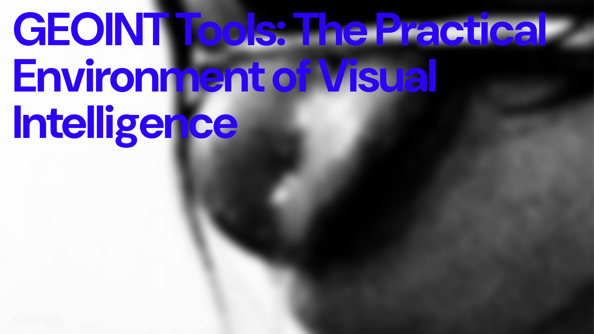

# GEOINT Tools: The Practical Environment of Visual Intelligence
 
*A structured guide to the software, platforms, and resources used in professional geospatial intelligence analysis*

 
Practical GEOINT is inseparable from the tools that support it. Visual intelligence relies on verifiable data, not intuition — and the tools analysts use shape not just the speed of analysis, but its reproducibility. That reproducibility matters enormously when findings need to be verified or handed off to other researchers.
 
> There is no universal solution. Every service shows only a fragment of reality — constrained by resolution, capture date, regional coverage, and technical limitations. Professional GEOINT practice is built on layering independent sources that either confirm each other or reveal contradictions.
 
It is also worth stating plainly: tools do not do the analysis for you. They provide data that must be interpreted, cross-referenced, and tested against analytical logic.
 
 
## Mapping and Satellite Platforms
 
Google Maps and Google Earth remain the baseline for most GEOINT work. Their value lies not just in availability but in how they integrate different data types — satellite imagery, schematic maps, terrain, and street-level panoramas — allowing analysts to examine terrain at different levels of abstraction.
 
Google Earth is especially important for terrain analysis and perspective work. The ability to tilt the camera, view terrain at an angle, and measure elevations is used in reconstructing the original camera position and analysing the horizon line. Historical layers allow analysts to track infrastructure changes, which often helps narrow down when an image was taken.
 
Bing Maps is used as an alternative satellite source. In some regions its imagery is more recent or has different spatial resolution. Comparing Google and Bing can reveal temporal discrepancies that directly indicate different capture dates — a simple cross-check that many analysts overlook.
 
OpenStreetMap functions as a structural and contextual source. It often outperforms commercial services in naming accuracy, building types, and local infrastructure — particularly in small towns and rural areas where commercial platforms have sparse or outdated data.
 
 
## Satellite Archives and Temporal Analysis
 
Temporal data is central to serious GEOINT work. Google Earth's historical layers are used for quick change assessment — construction, road reconstruction, new structures appearing. Google Earth Engine handles more complex cases: large geographic areas and long time series, enabling analysts to detect patterns of landscape change across months or years.
 
Sentinel Hub and services based on Sentinel and Landsat satellite data are widely used for analysing rural terrain, vegetation, and large regions. Despite lower spatial resolution, these sources are valued for their high update frequency and long-term archive depth.
 
> Historical satellite data becomes especially important when an analysis needs to confirm not just the location of an event, but the specific time period in which an image was captured. Geolocation without temporal context is an incomplete result.
 
 
## Terrain Analysis and Digital Elevation Models
 
Digital elevation models are among the most reliable GEOINT tools because terrain changes extremely slowly. SRTM and ASTER models are used to analyse elevation differences, slopes, valleys, and mountain ranges — data that remains valid across decades.
 
QGIS is the central tool for advanced terrain analysis. It allows analysts to layer satellite imagery, maps, elevation models, and custom datasets, and to calculate line-of-sight and elevation profiles. This is particularly useful for determining a possible camera position and verifying which objects would have been visible from a specific location.
 
In mountainous regions, specialised horizon-matching tools compare the mountain silhouette in a photograph against a digital terrain model. This method can significantly narrow the search area when other visual cues are ambiguous.
 
 
## Street Panoramas and Ground-Level Imagery
 
Google Street View remains the primary source of ground-level panoramas, though coverage is uneven and heavily region-dependent. In areas with limited coverage, analysts turn to Yandex Panoramas and local mapping platforms that serve specific countries or cities.
 
Mapillary plays an important role in GEOINT thanks to user-contributed photographs with precise geolocation and capture dates. These allow analysts to track infrastructure changes, find unusual angles, and confirm visual details absent from official panoramas — street signs, barriers, road markings, shop fronts.
 
Ground-level imagery is most useful for analysing fine urban details. It functions as a confirmation tool, not a standalone source of conclusions. This distinction matters: the temptation to treat a street panorama as definitive is one of the more common analytical errors.
 
 
## Image Analysis and Processing
 
Image processing is a supporting step in GEOINT, not the core of analysis. Adobe Photoshop and its open-source equivalent GIMP are used for contrast correction, colour adjustment, channel work, and reducing visual noise — operations that often surface details invisible on first viewing.
 
Vector editors such as Inkscape are used for precise proportion measurement and overlaying contours, particularly useful when comparing a photograph against a satellite image or building plan. Matching the proportions of a structure in a photo to its footprint on a satellite image is a reliable geolocation technique.
 
> A principle worth stating explicitly: processing an image does not create new information. It only improves the visual perception of data that was already there. Analysts who forget this tend to over-interpret enhanced imagery.
 
 
## Metadata and Digital Traces
 
ExifTool is the standard tool for analysing image and video metadata. Even without embedded GPS coordinates, it can determine camera model, shooting parameters, timestamps, and traces of software editing. Compression format, colour profiles, and file structure can sometimes provide indirect evidence of an image's origin or editing history.
 
Metadata rarely plays a decisive role on its own, but it can confirm or cast doubt on other elements of the analysis. A timestamp that contradicts an asserted date, or a camera model inconsistent with the claimed source, is a meaningful signal — not proof, but a reason to look harder.
 
 
## Video Analysis
 
Video is the richest format in visual intelligence. VLC Media Player is used for frame-by-frame review and precise timing control — capturing the moment key objects appear and analysing changes in lighting direction across a sequence. FFmpeg is used for frame extraction, video stream analysis, and working with timestamps, making it especially useful when synchronising footage with other data sources.
 
Audacity handles audio track analysis. Spectral analysis can identify characteristic sounds — traffic patterns, sirens, the acoustic properties of open versus enclosed environments — that may indicate terrain type and infrastructure even when the visual content is ambiguous or obscured.
 
 
## Weather and Astronomical Data
 
Meteorological archives such as NOAA and Meteostat are used to match visual cues against real historical weather conditions. Cloud cover, precipitation, temperature, and wind direction help verify the temporal context of an image. If a photograph shows clear skies over a location that records show was overcast on the claimed date, that is a problem worth investigating.
 
Astronomical tools that calculate solar position are used in shadow and lighting analysis. They allow analysts to determine whether an observed light direction is consistent with the proposed location and time of day. A mismatch between image lighting and the astronomical record is a strong indicator of geolocation error — or deliberate manipulation.
 
 
## Integrating Tools into the Analytical Process
 
No GEOINT tool is used in isolation. Satellite imagery is cross-referenced with ground-level panoramas, images are checked against metadata, and visual cues are verified against weather and temporal data. The workflow is not linear — it is iterative, with each new source either reinforcing or complicating what came before.
 
The quality of analysis is determined not by the number of tools used, but by the logic of how they are applied. Each new source should either strengthen a conclusion or create grounds for doubt. That tension — between confirmation and scepticism — is where real analysis happens. An analyst who is only looking for confirmation will find it, whether or not it is actually there.
 
 
## Conclusion
 
GEOINT tools form a complex, multi-layered ecosystem in which each programme and resource serves a specific purpose. Their strength lies not in automating conclusions, but in enabling analysts to test hypotheses from multiple independent directions.
 
Professional visual intelligence begins where the tools recede into the background — where analytical thinking, discipline, and the willingness to revise one's own conclusions become the decisive factors. The tools are a means. The question being asked, and the rigour with which it is pursued, is everything else.
 
